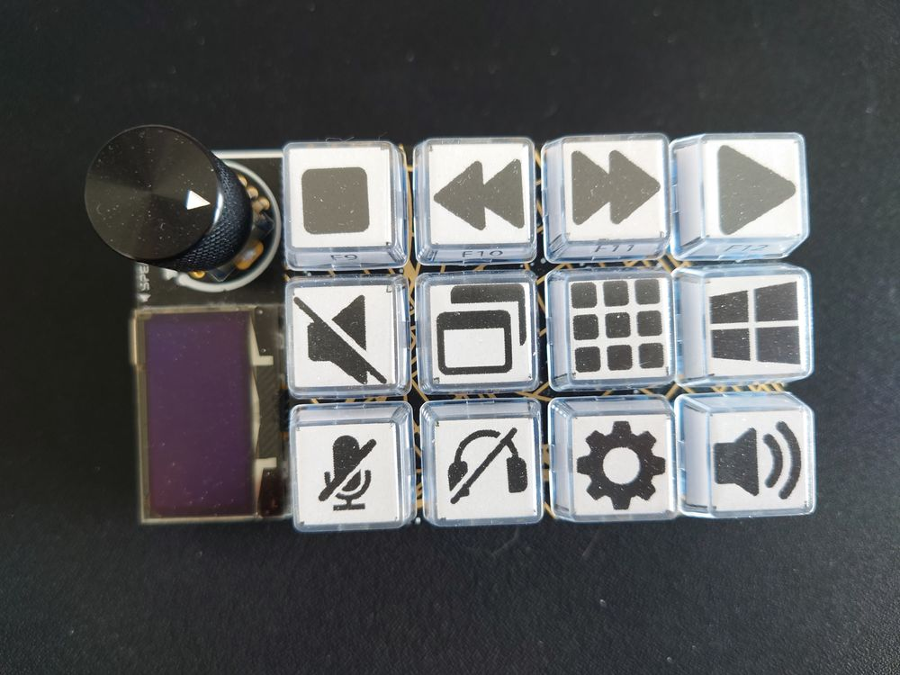

# RP2040-Macropad

https://www.adafruit.com/product/5128

Can run both CircuitPython or QMK.

Logo generated by [image2cpp](https://javl.github.io/image2cpp/)

## Flash with QMK CLI
`qmk flash -kb adafruit/macropad -km shigure -j 32`

### To Do
Replace slightly burnt OLED.

### Known Issue
Encoder won't wake up RGB.
Cannot set `RGB_MATRIX_DEFAULT_VAL`.
`KC_VAD` and `KC_VAI` didn't work.
